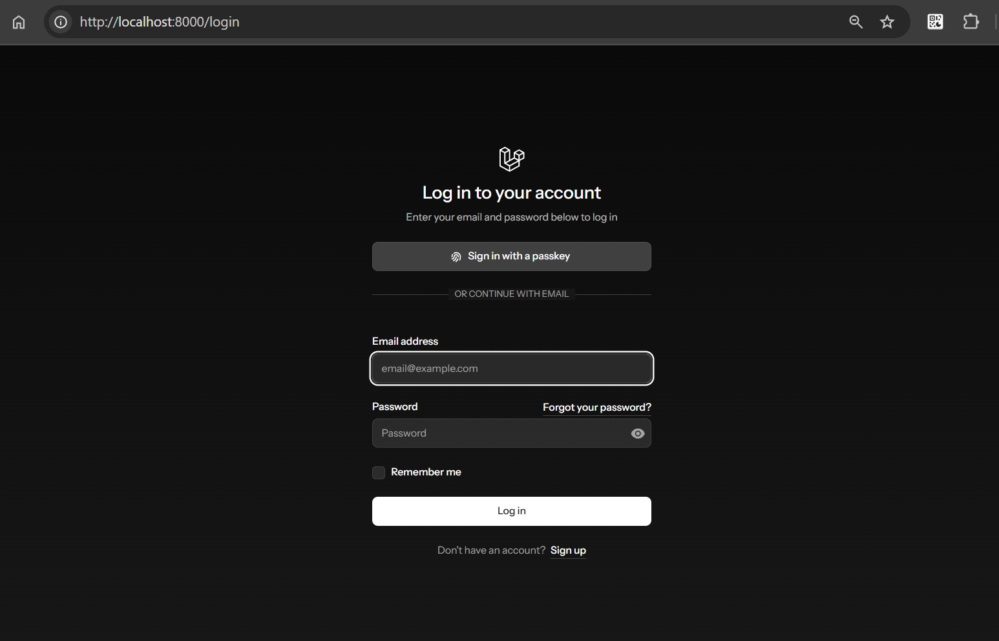
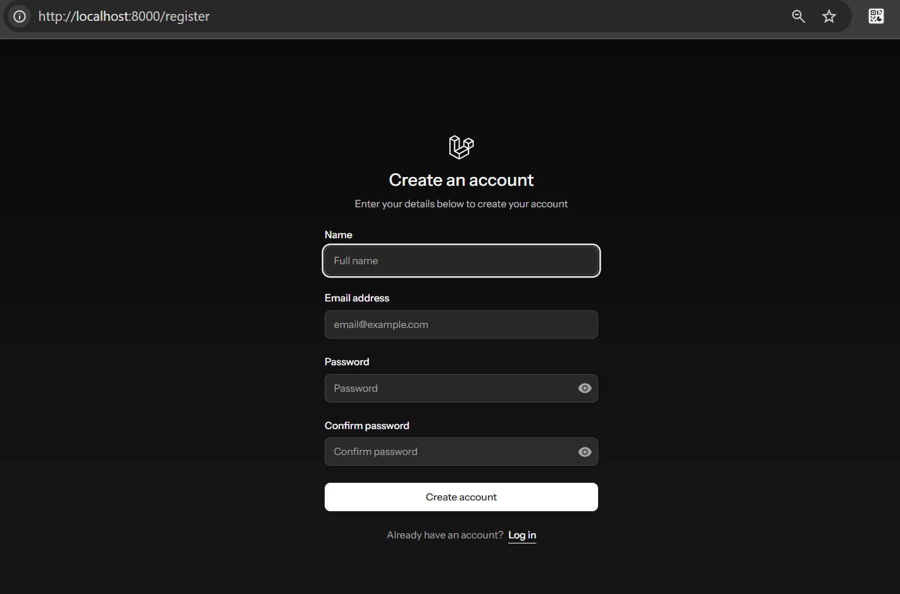
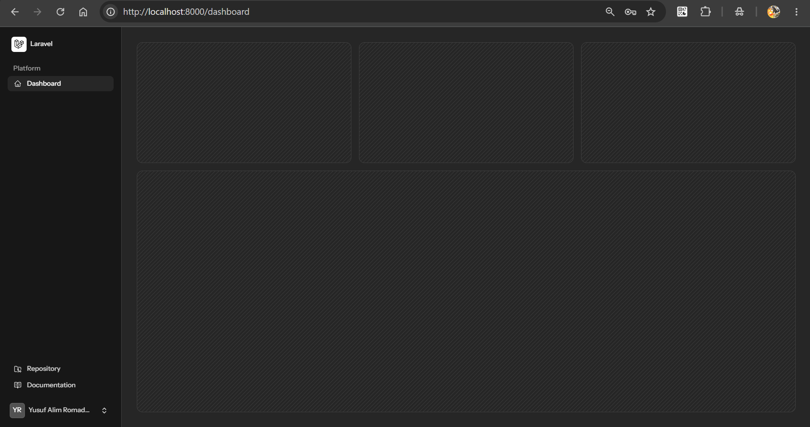

# Dokumentasi Progres Pengembangan






## 1. Informasi Proyek

**Nama proyek:** Sistem Jadwal Praktikum

Proyek ini merupakan aplikasi berbasis Laravel yang disiapkan sebagai dasar pengembangan sistem jadwal praktikum. Aplikasi saat ini sudah memiliki fondasi autentikasi, pengaturan akun, keamanan pengguna, serta tampilan dasar aplikasi.

## 2. Teknologi yang Digunakan

- PHP 8.3 atau lebih baru
- Laravel 13
- Livewire 4
- Flux UI 2
- Laravel Fortify untuk autentikasi
- Laravel Passkeys untuk autentikasi tanpa kata sandi
- Tailwind CSS 4
- Vite untuk proses bundling aset frontend
- Pest untuk pengujian
- Larastan dan Laravel Pint untuk pemeriksaan kode

## 3. Fitur yang Sudah Tersedia

### Autentikasi pengguna

- Halaman login dan registrasi disediakan melalui Laravel Fortify.
- Halaman dashboard hanya dapat diakses oleh pengguna yang sudah login dan melakukan verifikasi email.
- Pengguna yang belum login diarahkan untuk menggunakan halaman autentikasi.

### Pengaturan akun

Pengguna yang sudah login dapat mengakses:

- Pengaturan profil.
- Pengaturan tampilan aplikasi.
- Pengaturan keamanan.
- Penghapusan akun.

### Keamanan akun

- Halaman keamanan dilindungi oleh middleware konfirmasi password.
- Dukungan two-factor authentication (2FA) telah disiapkan.
- Data secret 2FA, recovery codes, dan waktu konfirmasi disimpan pada tabel `users`.
- Passkey dapat didaftarkan dan dikelola dari halaman keamanan.
- Endpoint `.well-known/passkey-endpoints` tersedia untuk proses enrollment dan pengelolaan passkey.

### Tampilan dasar aplikasi

- Halaman beranda publik tersedia.
- Dashboard menggunakan layout aplikasi dan mendukung tampilan responsif.
- Dukungan mode terang dan gelap telah disediakan pada komponen tampilan.

## 4. Route Utama

| Route | Nama | Akses | Keterangan |
| --- | --- | --- | --- |
| `/` | `home` | Publik | Halaman beranda |
| `/dashboard` | `dashboard` | Login dan email terverifikasi | Halaman dashboard |
| `/settings/profile` | `profile.edit` | Login | Pengaturan profil |
| `/settings/appearance` | `appearance.edit` | Login dan email terverifikasi | Pengaturan tampilan |
| `/settings/security` | `security.edit` | Login, email terverifikasi, konfirmasi password | Pengaturan keamanan |
| `/.well-known/passkey-endpoints` | `well-known.passkeys` | Publik | Informasi endpoint passkey |

## 5. Struktur Berkas Penting

- `app/Livewire/` berisi komponen interaktif Livewire.
- `app/Models/User.php` berisi model pengguna.
- `app/Actions/Fortify/` berisi action yang berkaitan dengan autentikasi Fortify.
- `database/migrations/` berisi struktur tabel pengguna, passkey, two-factor authentication, cache, dan jobs.
- `resources/views/pages/settings/` berisi halaman pengaturan profil, tampilan, dan keamanan.
- `resources/css/app.css` berisi gaya utama aplikasi.
- `resources/js/` berisi aset JavaScript, termasuk dukungan passkey.
- `routes/web.php` dan `routes/settings.php` berisi route aplikasi.
- `tests/` berisi pengujian fitur dan unit.

## 6. Persiapan dan Menjalankan Aplikasi

Pastikan perangkat sudah memiliki PHP, Composer, Node.js, dan npm.

```bash
composer install
npm install
```

Buat file environment dan isi konfigurasi database sesuai kebutuhan:

```bash
copy .env.example .env
php artisan key:generate
php artisan migrate
```

Jalankan server pengembangan dan Vite:

```bash
composer run dev
```

Alternatifnya, jalankan proses secara terpisah:

```bash
php artisan serve
npm run dev
```

## 7. Pemeriksaan Kode dan Pengujian

Pemeriksaan format kode PHP:

```bash
vendor/bin/pint --dirty --format agent
```

Pemeriksaan tipe dan pengujian:

```bash
php artisan test --compact
phpstan analyse
```

## 8. Pekerjaan Lanjutan

Beberapa bagian yang masih perlu dikembangkan untuk menjadikan aplikasi sebagai sistem jadwal praktikum yang lengkap:

- Menambahkan modul data praktikum, mata kuliah, kelas, ruangan, dosen, asisten, dan jadwal.
- Mengganti placeholder pada dashboard dengan ringkasan data jadwal.
- Menambahkan fitur pembuatan, perubahan, penghapusan, dan pencarian jadwal.
- Menambahkan validasi bentrok jadwal berdasarkan waktu, ruangan, kelas, dan pengajar.
- Menentukan peran pengguna, misalnya admin, dosen, asisten, dan mahasiswa.
- Menambahkan pengujian khusus untuk modul jadwal.
- Menambahkan seed data agar aplikasi mudah dicoba setelah instalasi.

## 9. Catatan Versi Dokumentasi

Dokumen ini dibuat berdasarkan struktur dan fitur yang tersedia pada proyek saat ini. Dokumentasi perlu diperbarui setiap kali ada perubahan besar pada fitur, database, route, atau alur pengguna.
